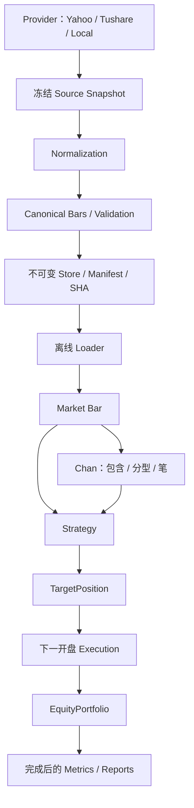

# Quant Lab 架构与兼容边界

## 依赖方向



`market/` 只包含 Enum、Timeframe、Bar、Instrument；数据、结构、策略、执行共用这一词汇。
数据层不知道 Chan。Chan 不知道 Provider、DataFrame、账户或订单。Engine 只调用 Strategy/Execution 接口，不导入 SMA 或 Chan。Provider/SDK 不进入离线 Loader 或回测依赖图。

## 可安装包

```bash
conda activate quant-lab
python -m pip install -e . --no-deps --no-build-isolation
python -m pytest -q
```

使用已有 Python 3.11 Conda 环境；新增工程能力没有新增运行依赖。setuptools 是环境已有的构建工具。
实现位于 `src/quant_lab/`。历史 `src.*` 模块仅转发兼容导出，新代码使用 `quant_lab.*`。
脚本不修改 `sys.path`，从任意工作目录运行前须完成 editable 安装。

| 模块 | 职责 |
| --- | --- |
| `market/` | AssetClass、Timeframe、不可变 Bar/Instrument |
| `data/providers/` | 供应商通信或本地文件读取；声明 capabilities |
| `data/normalization/` | 来源语义和单位转换；Yahoo/Tushare 保留经审计的 V2 规则 |
| `data/manifest.py` / `store.py` | 版本身份、不可变保存、SHA、文件与身份核验 |
| `data/loader.py` | 显式版本读取、筛选、DataFrame→Bar adapter |
| `data/resample.py` | 显式时区/anchor 的完整窗口聚合与 lineage |
| `chan/` | 增量包含、分型、笔；纯 Python，不生成交易 |
| `strategies/base.py` | `reset()` / `on_bar(context, bar)` → `TargetPosition` |
| `strategies/sma.py` | 收盘均线与 long/cash 目标；有界流式计算 |
| `strategies/chan_fx.py` | Chan 观察骨架；返回不可交易目标 |
| `backtest/engine.py` | 时间推进、上一收盘目标在下一开盘执行、收盘估值 |
| `backtest/execution.py` | EquityCash、首次可交易开盘买入的 benchmark；FX 明确未实现 |
| `backtest/portfolio.py` | EquityPortfolio 现金、整股、成本基础与损益 |
| `backtest/metrics.py` | 日快照风险指标；不读取未来价格 |
| `backtest/legacy.py` | 旧 SMA API、预热、benchmark 时点和报告列顺序 |
| `validation.py` | SMA/Strategy/Chan 未来变异检查 |

## V1 / V2 / V3

V1 `data/raw/spy_daily.parquet` 与 metadata 是原冻结复权 SPY 实验，不重写。
V2 文件、Manifest、session `date`、来源/复权规则保持原样；`load_bars()` 是历史 US/CN 日线兼容 API。
新 CLI 下载发布 schema_version=3；历史 Python `download_dataset()` 仍保留 V2 行为，以复现旧工具和测试。

V3：

- 必需 `timestamp, symbol, open, high, low, close`；timestamp 为 UTC aware、`bar_start`。
- 可选 `volume, tick_volume, amount, open_interest`。缺少代表未知，保留缺省；存在则必须完整、有限且非负；tick_volume 是整数。OHLC 必须正且关系成立。当前不支持负价格合约。
- Instrument 明确 `asset_class, venue, symbol, provider_symbol`，可带币种、tick/lot、合约倍数和到期日。
- 时间周期统一为 `1m/5m/15m/30m/1h/4h/1d`，按固定 elapsed duration 比较和判断聚合兼容。
- Manifest 记录时区、时间语义、Instrument、假设、版本、行数、区间、source/normalized SHA，并由 `.json.sha256` 校验自身。独立冻结 identity 绑定请求语义。
- 路径：`data/normalized/bars/{asset_class}/{venue}/{timeframe}/{symbol}/{dataset_id}/bars.parquet`。
- 一个冻结版本可以包含同一资产类别/venue 的多标的，返回 long format；当前交易账户仍为单标的。

```python
from quant_lab.data.loader import load_dataset, iter_bars

bars = load_dataset('explicit_dataset_id', symbols=['EURUSD'], timeframe='15m')
for bar in iter_bars(bars):
    print(bar.timestamp, bar.available_at)
```

V2→UTC adapter 必须显式指定 `session_timezone`，保留 session 午夜坐标；这不是实际交易所开盘时间。Yahoo/Tushare V3 日线同样记录该假设并保留 date 因子键。日线不能据此推导分钟线 session schedule。
V1 继续用 `legacy_provider_adjusted` 兼容入口，不冒充 raw。V3 Yahoo/Tushare 调整坐标仍用原审计因子，Local 和重采样 Forex 仅 raw。

## Local Provider

调用者声明来源时区、bar_start/bar_end、周期和 Instrument；供应商代码与 canonical symbol 分开。读取同一份文件字节，再冻结 original.bin、解析表和 request JSON，随后 normalization、validation、Manifest 发布。
没有联网 FX Provider。原文件随后删除也不影响冻结读取。脏输入导致明确失败，冻结 source 保留作审计但不发布成功 Manifest。
可选成交量/金额字段的单位由来源声明，程序不推断它们是股、手或真实 FX 成交量；本期 Forex 示例只使用 tick_volume。

## 重采样

必须提供目标周期、aggregation_timezone、HH:MM anchor。按本地墙钟锚点计算左闭右开窗口；输入严格匹配完整周期网格。
OHLC 为 first/max/min/last；volume、tick_volume、amount 求和，open_interest 取末值。
不完整边界窗口、内部缺失、重复、逆序、跨 DST 的不确定或变长窗口均失败，不补齐、不丢弃。需要不同 DST/session 规则时另行明确设计。
Derived Manifest 保留父 dataset ID、周期、normalized SHA、规则、时区、anchor；同时冻结父表与原始 Parquet 字节及父 Manifest。
聚合 bar 在目标窗口关闭后才可用；不能把其 close/high/low 当作窗口起点已知。

## Strategy 与执行时钟

策略只收到当前已完成的 Bar 和 `(index, available_at)`，无未来历史容器。
`TargetPosition(None)` 表示尚不可交易，0 表示 cash，1 表示 long；diagnostics 为不可变映射。
Engine 先在新 bar open 执行上一 bar 目标，再于当前完成时调用策略、估值、记录新目标。末根目标无下一开盘，不成交。
EquityCash 使用整股、全现金、两侧手续费与滑点；滑点进入 execution_price，不二次扣现金。Raw corporate action 事件尚未作用于账户。
新 generic equity 表记录 bar_return 与 valuation_time；历史日线报告保留原 daily_return 列。SMA 使用补偿滚动求和，冻结 SPY 的均线、账户、交易与 benchmark 逐值对照原 pandas 实现。
Forex spread/lot/leverage/margin/swap/short 未定义，FxExecutionModel 明确 NotImplemented；Chan observer 不创建虚假的 FX 账户或收益报告。

## 指标时钟

V3 bar 净值仍逐 bar 保存。风险/回撤使用 UTC 每天最后一个已知估值的 Daily Equity Snapshot，重算 daily_return 后使用配置的日频年化因子。
午夜恰好产生的估值归入新日；没有观测的日不补齐。CAGR 使用日快照的日历跨度，报告记录 metrics_frequency=daily、metrics_timezone=UTC。
历史 V1/V2 日线 API 保持原指标与输出定义。

## 验证与调试

```bash
python -m pytest -q
python scripts/verify_dataset.py --dataset-id <id>
python scripts/inspect_chan.py --dataset-id <id> --symbol EURUSD --plot
python -m pdb -c 'b src/quant_lab/chan/stroke.py:58' -c continue -m scripts.inspect_chan --dataset-id <id> --symbol EURUSD
```

没有框架事件总线、数据库、GUI、Broker、实盘或最终 Chan 买卖理论。可以直接断点查看 processor、fractal、tentative/confirmed 转移。
