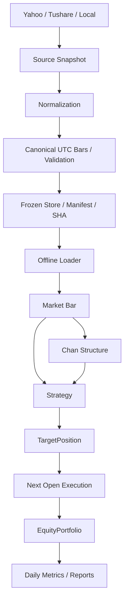

# Quant Lab 当前架构

源码直接位于 `src/`，统一使用 `src.*`。不在源码根目录下再创建项目名包。



## 职责与依赖

| 模块 | 职责 |
| --- | --- |
| `src/market/` | AssetClass、Timeframe、Bar、Instrument；不依赖供应商或交易 |
| `src/data/providers/` | 供应商通信/本地文件，声明能力；SDK lazy import |
| `src/data/normalization/` | 时间、字段、单位、拆股反向还原；daily date 是来源辅助键 |
| `src/data/validation.py` | 当前 Canonical Schema、因子、动作、引用表校验 |
| `src/data/manifest.py` / `store.py` | schema_version=3、身份、不可变保存、内容 SHA |
| `src/data/loader.py` | 显式版本读取、筛选、DataFrame→Bar |
| `src/data/resample.py` | 显式时区/anchor、完整聚合窗口、父版本 lineage |
| `src/chan/` | 增量包含/分型/笔；纯 Python，不导入数据层或绘图库 |
| `src/strategies/` | 当前已完成 Bar→不可变 TargetPosition；不管理账户 |
| `src/backtest/engine.py` | 推进时钟；不导入 SMA 或 Chan 专属实现 |
| `src/backtest/execution.py` | 成交价格/成本/constraints；Equity long/cash，FX 未定义 |
| `src/backtest/portfolio.py` | EquityPortfolio 的现金、持仓、损益 |
| `src/backtest/metrics.py` | 从完成结果计算 Daily Equity Snapshot 与绩效 |
| `src/validation.py` | Strategy/Chan 未来变异与确认时点因果性 |

## 正式数据

Canonical Bar 必需 UTC timestamp、symbol、OHLC；可选 volume/tick_volume/amount/open_interest。timestamp 语义为 bar_start，已知时间为 timestamp+固定 timeframe duration。
只维护 schema_version=3 Manifest，校验不支持的版本明确失败。date 可作为股票日线因子、公司行动或日历的 session key，不能替代 canonical timestamp。
Yahoo/Tushare 当前只供应 equity daily，daily session 午夜转 UTC 的假设写入 Manifest。Local 使用调用者指定的 source_timezone 与 bar_start/bar_end，aware offset 必须与声明一致。
Loader 明确 dataset ID，核验完整文件后才筛选；同一个版本可包含同一 asset_class/venue 的多标的，不代表多资产账户已实现。
原文件字节、响应表、request 元数据均可冻结；Manifest 由自身 SHA sidecar 保护，identity 独立冻结。

## 价格与窗口

raw OHLC 由 normalization 产生，供应商 Source 不等于 raw price。Yahoo 拆股反向还原与 Tushare 手/千元转换保持明确审计假设。
因子使用 exact session key；qfq 使用请求结束时点之前的最新 factor，hfq 保留累计绝对尺度。账户未处理公司行动。
重采样按明确 local anchor 的左闭右开窗口，固定周期必须整除目标周期。完整源网格才生成目标 bar；缺失、partial、DST 不确定/变长边界失败。目标 close 只在目标窗口关闭后可用。

## 回测时序与指标

Engine 在当前 open 执行上一完成 bar 的 target，再于当前 close 调用策略并估值。StrategyContext 只提供 index 和当前 available_at。
TargetPosition(None) 为不可交易，0 为 cash，1 为 long。diagnostics 不能覆盖账户或执行字段。
Equity 买入整股、全现金，卖出清仓；commission 单独扣款，slippage 已进入 execution_price，slippage_cost 仅作归因。
Benchmark 在预热后首次可执行 open 尝试买入一次；没有 next open 的最终信号不成交。
逐 bar 净值保存 bar_return 和 valuation_time。风险/回撤取 UTC 每日最后估值并重算 daily_return，午夜估值归新日，不补无观测日。CAGR 用日快照的日历跨度。
ChanFxStrategy 返回不可交易目标，只输出结构；Forex/Futures 执行未定义，不能用 Equity 账户假装模拟。

## 运行与断点

```bash
conda activate quant-lab
python -m pytest -q
python scripts/verify_dataset.py --dataset-id <id>
python scripts/inspect_chan.py --dataset-id <id> --symbol EURUSD --plot
python -m pdb -c 'b src/chan/stroke.py:58' -c continue -m scripts.inspect_chan --dataset-id <id> --symbol EURUSD
```

直接脚本执行会加入项目根目录；`python -m scripts.xxx` 可从项目根目录运行。可选 editable 安装只发现 `src` 包，不创建新的源码层。
没有数据库、框架事件总线、GUI、Broker 或实时交易。
